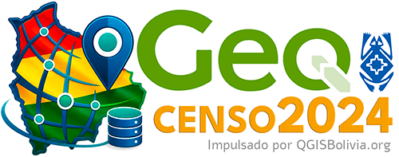

# GeoCenso2024

**GeoCenso2024** es un complemento para QGIS orientado a facilitar el uso de información geoespacial relacionada con el Censo 2024 de Bolivia.

Permite descargar, organizar y vincular datos geoespaciales dentro de QGIS, facilitando el trabajo técnico con capas como manzanos, poblaciones y otras unidades territoriales.

## Funciones principales

- Acceder a mapas de poblaciones por municipio.
- Acceder a mapas de manzanos por población urbana.
- Vinculación de datos censales con las capas descargadas.
- Uso de caché local para evitar descargas repetidas.

## Requisitos

- QGIS 3.44 (Soporte para archivos Parquet y Geoparquet).
- Conexión a internet.
- Compatible con QGIS 4

## Instalación

Debe descargarse de este repositorio e instalar manualmente por ZIP dentro de QGIS.

## Base de Datos

Base de datos sistematizada a partir de las fichas resumen descargadas desde el Geoportal del INE. Los datos se encuentran organizados en la sección data de este repositorio, en formatos Apache Parquet y Apache GeoParquet. La estructura de los archivos ha sido adaptada y codificada específicamente para su integración y funcionamiento dentro del complemento.

## Estandarización de poblaciones urbanas y rurales a representación de puntos
En el formato original de los datos del Censo, las poblaciones rurales se encuentran representadas mediante puntos, mientras que las poblaciones urbanas están representadas mediante polígonos. Con fines de análisis y estandarización, la base principal fue uniformizada a una representación puntual.

Para ello, se generaron centroides a partir de los grupos de polígonos que representaban poblaciones urbanas, consolidando sus atributos y sumando los datos correspondientes. De esta manera, cada población urbana queda representada por un punto único con información agregada.

## Aviso importante
Este complemento no es oficial. Para uso técnico, académico o institucional, la información debe validarse previamente con las plataformas oficiales del INE.

## Autor
Sistematizado y desarrollado por:
Ing. MSc. Jorge Ayala Niño de Guzmán

## Licencia
Este proyecto se distribuye bajo una licencia compatible con GPL para su publicación como complemento de QGIS.
